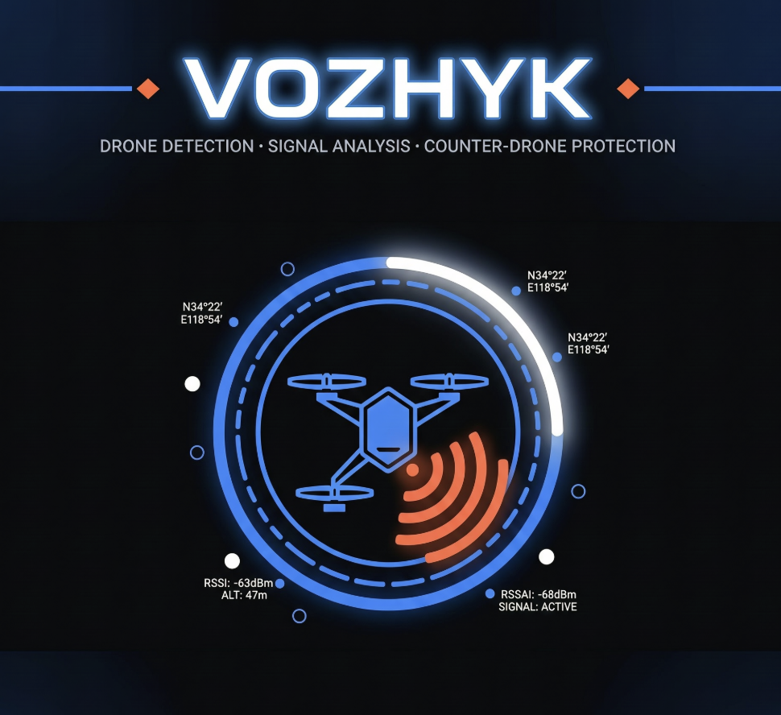

## Built for

OpenAI Build Week 2026

## Powered by

- OpenAI Codex
- GPT-5
- SwiftUI
- Core ML
- Vision Framework
- YOLO-World

feedback id: 019f6a59-5a57-74a2-98dd-8c77f5f37a1a

<p align="center">
  
</p>

# DroneDetector — iOS App

iPhone app for the **Vozhyk** anti-drone project. Uses the rear camera for visual drone detection and the phone's Bluetooth/Wi-Fi radios to spot drone-like RF signatures.

The app runs live on the iPhone and automatically analyzes the camera stream. It detects common visible objects such as autos, humans, trucks, buses, motorcycles, birds, and planes with the bundled YOLO model, while a separate custom Core ML model detects `plane_drone` objects from our own fine-tuned training data. This dual-model setup keeps normal object recognition available while improving detection of the drone/plane target class.

For long-distance objects, the camera uses automatic zoom assistance. When the user holds the iPhone stable for a short moment, the app gradually zooms the real camera feed up to 5x so small distant flying objects become easier for the model to inspect. If the phone moves or turns again, zoom resets back to the default view.

The app also performs radio-side checks that are available on iPhone. It scans Bluetooth Low Energy signals and checks Wi-Fi SSID patterns where iOS permits access, looking for known drone/controller signatures such as DJI, Parrot, FPV, and similar radio names. The visual and radio signals are combined into the on-screen threat state.

## Presentation Video

https://youtu.be/UbPek3CEMGw

## About Project

Read the full hackathon project description in [about.md](about.md).

## Features

- **Live camera feed** with bounding-box overlays
- **General object detection** for autos, humans, trucks, buses, motorcycles, birds, and planes
- **Fine-tuned plane-drone detection** using our custom Core ML model trained from reviewed video data
- **Dual-model pipeline**: custom `plane_drone` model plus preserved YOLO general detector
- **Automatic camera zoom** when the iPhone is stable, up to 5x for distant object inspection
- **BLE 2.4 GHz scanner** for DJI, Parrot, FPV controllers, and similar known drone/controller signals
- **Wi-Fi SSID check** for known drone network names (when iOS allows)
- **On-screen threat HUD**: CLEAR / POSSIBLE DRONE / DRONE DETECTED

## Requirements

- Mac with **Xcode 15+**
- iPhone running **iOS 16+** (iPhone 12+ recommended for Neural Engine)
- Free Apple ID or paid Apple Developer account

## Open in Xcode

```bash
open iphone_detector/DroneDetector.xcodeproj
```

1. Select your **Team** under Signing & Capabilities (target → DroneDetector).
2. Connect your iPhone via USB.
3. Choose your iPhone as the run destination.
4. Press **Run** (⌘R).

On first launch, allow **Camera**, **Bluetooth**, and **Location** (location is required by iOS for Wi-Fi SSID access).

## Drone-aware model

The app works immediately with motion-based aerial object detection. For better accuracy, add a YOLO model.

**Important:** use a project venv. Global NumPy 2.x breaks Core ML export (`Numpy is not available` / `_ARRAY_API not found`).

```bash
cd iphone_detector
python3.11 -m venv .venv
source .venv/bin/activate
pip install -r scripts/requirements.txt
python scripts/download_model.py
```

The project uses `DroneDetector/Models/DroneDetector.mlpackage`, a YOLO-World model configured only for: Auto (car), Plane, Drone, Bird, Human, Bus, Truck, and Motorcycle. After a successful Run, the HUD should show **AI Model Ready** / `YOLO-World Core ML`.

### Branding

- **App icon:** `logo.png` → `Assets.xcassets/AppIcon` (1024×1024)
- **Launch / splash:** `app_start.png` → `LaunchScreen.storyboard` + in-app `SplashView` (~1.2s)
- **Home screen name:** **Vozhyk**

YOLO-World supports a real `drone` prompt without treating kites as drones. The model is intentionally restricted to the app's existing object list, and the app requires three spatially consistent model detections before it displays an alert.

To make a real detector, collect and label images with these classes: `drone`, `bird`, `aircraft`, and `kite`. Include clouds, branches, glare, insects, and moving-camera scenes as unlabelled hard negatives. Keep each video/flight recording entirely within one of train, validation, or test splits.

```bash
cd iphone_detector
source .venv/bin/activate
cp datasets/drone.yaml.example datasets/drone.yaml
# Edit the dataset path in datasets/drone.yaml
python scripts/train_drone_model.py --data datasets/drone.yaml --device mps
```

The script exports `DroneDetector/Models/DroneDetector.mlpackage`. Drag it into the Xcode target. The app automatically prefers this custom model over the bundled COCO model.

## Radio Detection Notes

iOS does **not** expose raw spectrum analysis (433 MHz LoRa, 5.8 GHz FPV video, etc.). This app uses what the iPhone can access:

| Method | Band | What it detects |
|--------|------|-----------------|
| CoreBluetooth BLE scan | 2.4 GHz | Drone controllers, DJI BLE, FPV gear |
| Wi-Fi SSID check | 2.4 / 5 GHz | Connected or visible drone Wi-Fi names |

For full RF coverage (433 MHz RC, 5.8 GHz VTX), you still need external hardware on the rover (e.g. SX1278 LoRa module) as described in `solution.md`.

## Project Structure

```
iphone_detector/
├── DroneDetector.xcodeproj
├── DroneDetector/
│   ├── Camera/          # AVFoundation + Vision
│   ├── Radio/           # BLE + Wi-Fi RF scanner
│   ├── Views/           # SwiftUI overlays & HUD
│   └── Models/          # Core ML model (after download)
└── scripts/
    └── download_model.py
```

## Next Steps (Part 2)

This app is the **eyes & brain** on the iPhone. The next integration step is sending targeting coordinates to the STM32 rover over **Bluetooth BLE** (`T:-120,45\n` format from `solution.md`).

The planned hardware extension is to mount the iPhone on a mobile system, use the camera model to detect a drone in the air, then send the detected target position over BLE to an STM32 module. The STM32 will control servos that point a dedicated positioning ray toward the detected drone location.
